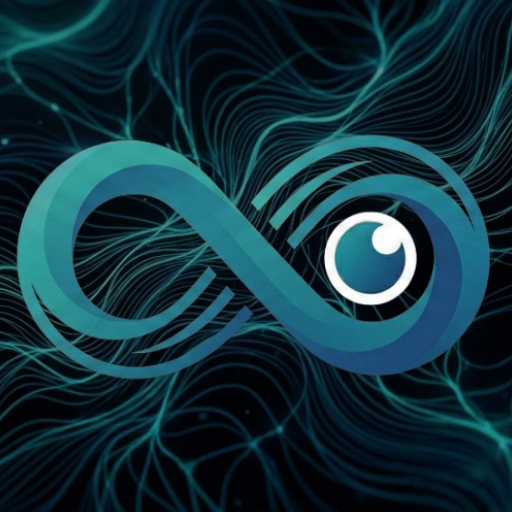

#  Споглядайко Dashboard

Android dashboard app for the [analyze-video](https://github.com/alivespirit/analyze-video) surveillance system.

## Features

- **Today's Stats** (first tab) — Status counts with tap-to-exclude filter (persistent across restarts), gate crossings (tap to open Хвіртка page), processing time chart (log scale with hour markers), away/back intervals (today's open interval shows elapsed time since the person left).
- **Події** (second tab, VideoLibrary icon) — Per-video summary with status, gate direction, ReID scores, processing time, frames indicator, worker/local indicator, speed pill, and a pipeline-error warning icon when post-detection stages (Gemini/Telegram) failed. Tap to open the video detail screen.
- **Video detail** — Tabbed view: Logs, Player (highlight + full video, both lazy-loaded), Crops, Frames, and Pose. The Player tab is hidden when neither highlight nor full video is available; the Pose tab appears only when pose clips exist for the video. Player controls use a two-phase auto-hide (fast right after playback starts, slower for subsequent interactions). Log lines that reference `gallery_crop=<file>` render the filename as a clickable link — tap to view the gallery reference fullscreen, long-press to delete it from the positive/negative gallery.
- **Хвіртка** — Gate area overview: all videos with ReID crops shown with timestamps, direction arrows or per-direction person counts (`N↑` / `N↓`) when multiple people crossed, match scores, away/back chip, and crop thumbnails (matched-person crops outlined in the ReID-match color). Tap crops for fullscreen zoom, long-press to copy to positive/negative gallery. Pull-to-refresh defers the scroll-to-top until newly fetched items have been laid out.
- **Overall Stats** — ReID auto-detection accuracy card with Precision / Recall / F1 / Match-score headline numbers, toggleable per-series line chart (7-day moving average + faint daily), 7d / 30d / 90d / All range filter, and a per-day "recognition wall" of ReID crop thumbnails (outcome-colored borders, match score badge) that appears when you tap a day on the chart — tap a crop to open the video. Below: per-day video counts (selectable bars), processing times per day with toggleable Motion Detection / Full Processing series, weekday heatmaps for away/back events (tap cells for per-occurrence date+time lists). All chart ranges persist across app restarts.
- **Monitoring** — Master CPU/RAM/battery, worker status/load/CPU temp/RAM/battery, recent processing ledger. Auto-refreshes every 15 seconds.
- **Notifications** — Foreground service showing current home/away status ("Вдома з 14:05" / "Десь там з 10:15"). When a confident same-weekday pattern exists, the status line is extended with a prediction of the next leave/return — e.g. "Вдома з 14:53, може піде о 19:40 (66%)" or "Десь там з 11:15, може повернеться найближчим часом (65%)". Predictions only appear when ≥4 historical samples for that weekday, ≥30% confidence, and within a 3-hour horizon. Away/back event alerts include a ReID crop image preview (tries the matched-person `_m` crop first, falls back to the unsuffixed crop). Tap notification to open the corresponding video.
- **Date navigation** — Calendar icon in top bar to switch between available log days. Only days with logs are selectable.
- **Light/Dark theme** — Auto-matches device theme, or manually selectable (Auto/Light/Dark) in Settings.
- **ReID gallery management** — Long-press ReID crops to copy to positive or negative gallery; long-press a `gallery_crop=` link in the logs to delete that reference image from the gallery.

## Prerequisites

1. Install **Android Studio** (Ladybug 2024.2 or later)
2. Accept Android SDK licenses, install SDK 35
3. On your Android phone:
   - Settings > About > tap "Build number" 7 times to enable Developer Options
   - Developer Options > enable "USB debugging"
4. The master must be running [analyze-video v8.0.0](https://github.com/alivespirit/analyze-video/releases/tag/v8.0.0) or newer with `ENABLE_LOG_DASHBOARD=true` (this version introduced the pose, full-video, and gallery management endpoints consumed by the app).

## Build & Install

```bash
# Build debug APK
./gradlew assembleDebug

# Install on USB-connected device
./gradlew installDebug

# Or wireless (same WiFi network):
# Phone: Developer Options > Wireless debugging > Pair
adb pair <phone-ip>:<port>
adb connect <phone-ip>:<port>
./gradlew installDebug
```

APK location: `app/build/outputs/apk/debug/app-debug.apk`

## Configuration

In the app, tap the gear icon (Settings):
- **Server URL**: Default `http://192.168.1.33:8192`. Change if your master IP or port differs.
- **Poll interval**: How often the foreground service checks for away/back events (default 30s).
- **Notifications**: Toggle the foreground service on/off.
- **Theme**: Auto (system) / Light / Dark.

## Server-Side API Endpoints

The master must be running analyze-video v8.0.0 or newer (`tools/log_dashboard/app.py`), exposing these JSON API endpoints:

| Endpoint | Description |
|----------|-------------|
| `GET /api/days` | List of available log days (YYYY-MM-DD) |
| `GET /api/today/videos?day=` | Video summary list with status, ReID, frames indicator, speed, `pipeline_error` |
| `GET /api/today/video/{basename}/logs?day=` | Log entries per video |
| `GET /api/today/video/{basename}/reid-crops` | ReID crop image URLs (matched-person crops use the `_m.jpg` suffix) |
| `GET /api/today/video/{basename}/frames` | Insignificant/no_person frame URLs |
| `GET /api/today/video/{basename}/highlight` | Highlight clip URL if available |
| `GET /api/today/video/{basename}/pose` | Pose clip URLs (when POSE_ENABLED on the master) |
| `GET /api/today/video/{basename}/full` | Full source video URL — only returned if the source file currently exists on disk |
| `GET /api/today/gate-crossings?day=` | Videos with ReID crops, including `persons_up` / `persons_down` and `away_back` |
| `GET /api/today/stats?day=` | Today's aggregated stats; today's open away intervals include elapsed `dur` and an `ongoing` flag |
| `GET /api/stats/overall` | Overall stats with heatmaps; weekday and time-of-day heatmaps use cache-extended history beyond log retention, weekday cells include per-bin `away_occurrences` / `back_occurrences` |
| `GET /api/stats/reid` | ReID accuracy per day (TP/FP/FN, precision/recall/F1, match score) + 7-day moving average + per-day events with `kind`, `score`, and `crop_url` for the recognition-wall view |
| `GET /api/monitoring` | System monitoring (CPU, RAM, battery, worker health) |
| `GET /api/events/latest?since=` | Away/back events for notifications; may include `next_prediction` (same-weekday pattern, ≥30% confidence, within 3 h horizon) |
| `POST /api/reid/copy` | Copy ReID crop to positive/negative gallery |
| `GET /api/gallery/{target}/{filename}` | Serve a positive/negative gallery reference crop |
| `DELETE /api/gallery/{target}/{filename}` | Delete a gallery reference crop (ReID embedding cache rebuilds automatically on the next run) |
| `GET /api/image/{basename}` | Serve image files (crops, frames) |
| `GET /api/highlight/{basename}` | Serve highlight and pose clips |
| `GET /video/{basename}` | Serve full video files |

The worker also needs the updated `/health` endpoint (in `worker/server.py`) that includes load average, RAM stats, and CPU temperature.

## Tech Stack

- Kotlin + Jetpack Compose + Material 3
- Ktor Client (HTTP) + kotlinx.serialization (JSON)
- AndroidX Media3 / ExoPlayer (video playback with fullscreen support)
- Coil (image loading with full-resolution zoom)
- Koin (dependency injection)
- Jetpack DataStore (preferences)
- Foreground Service (event polling + notifications with BigPictureStyle)

## Important Notes

- The app uses cleartext HTTP (`android:usesCleartextTraffic="true"`) since the master serves on HTTP within the local network.
- Android 13+ requires runtime notification permission — the app requests it on first launch.
- The foreground service auto-starts on app launch if notifications are enabled.
- Highlight clips are saved to daily directories in TEMP_DIR and kept after Telegram send (controlled by `KEEP_HIGHLIGHTS_CLIPS` env var, default `true`).
- When the worker is enabled but unreachable, the monitoring tab shows it with an "offline" chip instead of hiding it.
